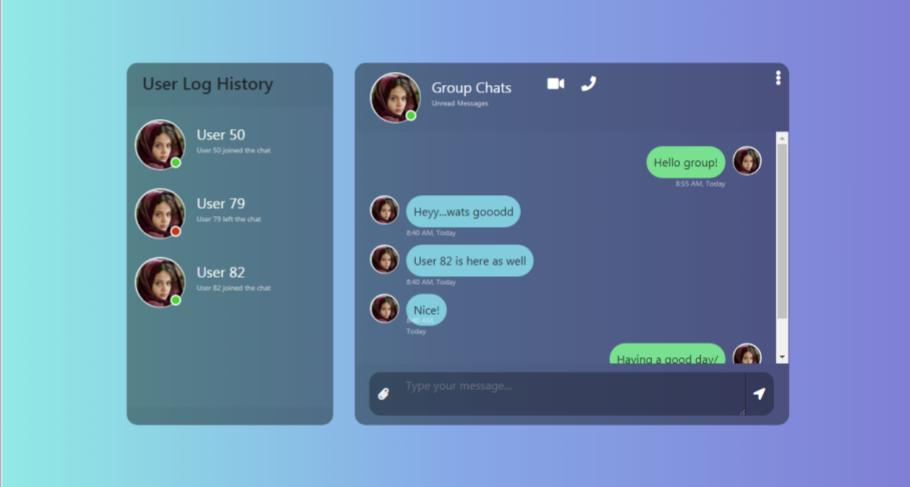

# php_chat_websockets
PHP Chat Application (With jQuery, Bootstrap, Ratchet, WebSockets)

## Overview
This is an implementation of websockets with Ratchet. Websockets allow you to retrieve data in real time just like with chat applications and investment data where real time communication is necessary.
The program is written in PHP and is easy to follow and replicate. 

## Steps

### 1. Clone the git repository 
Copy the git remote link of the project and on your terminal type:

    git clone <link>
    
You may also just directly download from GitHub.

### 2. Run the server
Next step is to navigate to the parent folder of the project (now on your local computer), then run the server.
To run the server, in your terminal type:

php server.php 

Make sure that PHP is installed and included in your environment variable path, else the command 'php' would not be recognized.

### 3. Run Program On Local Server
If you use local Apache servers or softwares like Wamp Server, you may now run this PHP application on your server. Make sure that step 2 is complete before running the chat application.
The chat application would not work if the server is not running yet.

### Additional Implementations

You may decide to include a database to save messages. Eloquent in Laravel (PHP framework) can be used to connect to your database. This can now be easily implemented. 
Also, you could make direct insertions into your table right from the 'ChatApp.php' file in 'src' if you want. A database feature allows you to retrieve chat history and make use of actual usernames.

